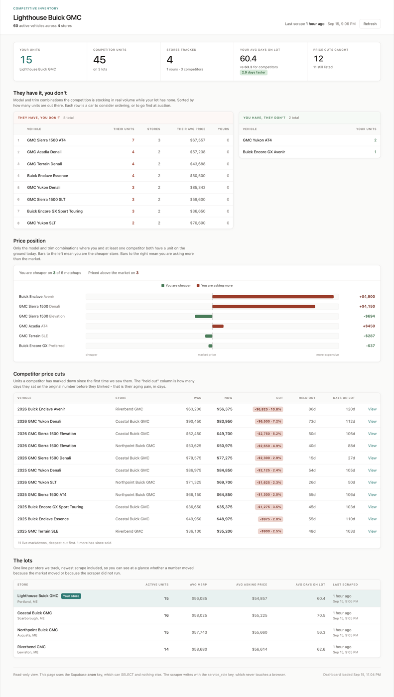

# Dealership Inventory Scraper

Know what every competitor in your market has on the ground, and what they're asking for it,
before your 8am sales meeting.

This tool reads your competitors' public inventory pages once a day and files every vehicle
into a database you own. After a couple of weeks you can answer questions you currently
guess at:

- Who else has a Denali Ultimate in white within 60 miles, and what are they asking?
- Which of my units has been sitting longest compared to the same trim down the road?
- Did the store in the next town just drop $2,000 across their Sierra 1500s?
- How many days did that trim take to move at their price, versus mine?

It is built to be set up by Claude Code. You paste ten plain-English prompts, in order, and
Claude handles the terminal and your Supabase database. The only things you supply are one
Supabase login, one copied key, your store and competitors' web addresses, and a GitHub
login.

**What it is not:** it reads public web pages only, the same ones any shopper can see. It
never touches a login, a dealer portal, or a DMS.

---

## What you end up looking at



The scraping is not the point. This is the point. Once there is inventory in the database,
open the dashboard and you get four answers:

- **They have it, you don't.** Model and trim the competition is stocking in real volume
  while your lot has none. Every row is a car to consider ordering, or to go find at
  auction.
- **Price position.** Where you and a competitor both have the same trim on the ground,
  who is cheaper and by how much.
- **Competitor price cuts.** Units a competitor has marked down since the first time we
  saw them, and how many days they sat on the original number before they blinked. They
  did not announce that cut and they cannot hide it.
- **The lots.** One line per store: units, average price, average days on lot.

It is already built, so running it needs nothing but Python — no npm, no build step:

```bash
python3 -m http.server 8000 --directory dashboard
```

Then open http://localhost:8000. It reads your Supabase URL and anon key from
`dashboard/config.js`. See [dashboard/README.md](dashboard/README.md).

The dashboard reads with Supabase's **anon** key, which can SELECT and nothing else. The
scraper writes with the service_role key, which never touches a browser. That split is why
`sql/schema.sql` sets up row level security the way it does.

---

## Quickstart

**Before you start:** a Claude Pro, Max, Team or Enterprise plan, a free
[Supabase](https://supabase.com) account, and a free [GitHub](https://github.com) account for
the last step. Python 3.9 or newer; Claude will tell you if it is missing.

**0. Set up Claude Code** (in your terminal: Terminal on Mac, PowerShell on Windows)

1. Install Claude Code.
   - Mac / Linux: `curl -fsSL https://claude.ai/install.sh | bash`
   - Windows: install [Git for Windows](https://git-scm.com/downloads/win) first, then
     `irm https://claude.ai/install.ps1 | iex`

   Check it: `claude --version` prints a version number and "(Claude Code)".
2. Make a folder for this project and go into it.
   - Mac / Linux: `mkdir -p ~/spy-then-sell && cd ~/spy-then-sell`
   - Windows: `mkdir $HOME\spy-then-sell; cd $HOME\spy-then-sell`
3. Connect Supabase to Claude in this folder:
   `claude mcp add --transport http supabase https://mcp.supabase.com/mcp`
4. Start Claude in this folder: `claude --dangerously-skip-permissions`

   The first time, log in in the browser if asked, then accept the warning. This flag lets
   Claude run commands and change files in this folder without stopping to ask you each
   time. Only use it in this project folder, and never with `sudo`.

Then paste each prompt below into Claude Code, one at a time, and let it finish before the
next. Anything in [brackets] is yours to fill in.

**1. Get the code**

> Clone https://github.com/esurratt4/LearnClaudeForDealers into this folder. Read CLAUDE.md
> and do the setup: create the Python virtual environment, install the requirements, and
> install the Playwright browser. Tell me when it's done.

**2. Tour the files**

| Path | What it is |
|---|---|
| `config/dealers.yml` | Your store and your competitors |
| `.env` | Your secret keys (created in step 5, never uploaded) |
| `sql/schema.sql` | Builds your database |
| `scraper/` | The code that reads dealer websites |
| `dashboard/` | Your dashboard |
| `CLAUDE.md` | The instructions Claude follows in this project |
| `.github/workflows` | The daily schedule |

**3. Log Claude in to Supabase**

In Claude Code, type `/mcp` > **supabase** > **Authenticate**. The browser opens: log in,
choose your organization, and approve. Back in Claude Code, supabase shows **Connected**.

**4. Create your database**

> Use the Supabase MCP to create a new project called spy-then-sell in my organization.
> Wait until it's ready, then apply sql/schema.sql to it and confirm the vehicles,
> scraper_runs and price_history tables exist.

**5. Connect your keys**

> Get my spy-then-sell project URL and legacy anon key from the Supabase MCP. Put the URL
> in .env, and the URL and anon key in the dashboard config. Then give me the direct link
> to the page where I copy my service_role key.

Open the link Claude gives you > **Legacy API keys** tab > **service_role** > **Reveal** >
**Copy**. Then:

> Here is my service_role key: [paste]. Put it in .env and run the doctor.

| Key | What it is |
|---|---|
| Project URL | Your database's address. Not secret. |
| anon key | Read-only. The dashboard uses it. |
| service_role key | Full write access. The scraper uses it. Secret: only ever paste it into Claude Code on your own laptop. |

Success: the doctor shows PASS lines, including "write access confirmed", and ends
"RESULT: ready to scrape."

**6. Add your dealership and competitors**

> Set up config/dealers.yml. My store is [dealership name], [website], [city, state]. My
> competitors are [name, website, city, state] and [name, website, city, state]. Then run
> --detect and tell me what platform each site is on.

**7. Test scrape**

> Do a dry run on my store with a limit of 10 and tell me if the data looks right.

**8. Real scrape**

> Run the scraper on all my dealers with a limit of 10. Then use the Supabase MCP to tell
> me how many vehicles are saved for each dealer.

**9. Open your dashboard**

> Start the dashboard and give me the link to open.

Open http://localhost:8000. Filter by dealer, make and model; see what competitors stock
that you don't, where you sit on price, and who has cut prices.

**10. Make it yours**

Ask for anything. For example:

> Add a chart to my dashboard comparing how many vehicles each dealer has in each $10,000 price range.

**11. Run it every morning**

> Create a private GitHub repo for this project under my account and push it. Add
> SUPABASE_URL and SUPABASE_SERVICE_ROLE_KEY as repository secrets, turn on the Daily
> Inventory Scrape workflow, and start one test run.

### Doing it by hand instead

With the virtual environment active (`source venv/bin/activate`, Windows Git Bash
`source venv/Scripts/activate`):

```bash
python -m scraper.run --doctor                                   # keys, connection, tables
python -m scraper.run --detect                                   # platform of each site
python -m scraper.run --dealer my-store --limit 10 --dry-run     # scrapes, saves nothing
python -m scraper.run --all --limit 10                           # small real run
python -m scraper.run --all                                      # the full run
python3 -m http.server 8000 --directory dashboard                # dashboard at localhost:8000
```

Keys go in `.env` (copy `.env.example`) and `dashboard/config.js` (copy
`dashboard/config.example.js`). Always `--dry-run` a new dealer before letting it write.

---

## Point it at your own sites

Everything the scraper knows about lives in `config/dealers.yml`. Use real homepage URLs,
copied from your browser.

```yaml
# Your store goes under own_store. Everyone you watch goes under competitors.
own_store:
  key: my-store
  name: Main Street Buick GMC
  url: https://www.mainstreetbuickgmc.com
  city: Springfield
  state: IL
  # platform is left out on purpose — the scraper detects it.

competitors:
  - key: rival-chevy
    name: Rival Chevrolet
    url: https://www.rivalchevrolet.com
    city: Decatur
    state: IL

  - key: crosstown-gmc
    name: Crosstown GMC
    url: https://www.crosstowngmc.com
    city: Bloomington
    state: IL
    makes: ["GMC"]        # optional: only keep these brands
    condition: used       # optional: "new" (default) or "used"

  # Dealer.com stores are the one exception — spell both of these out.
  - key: westside-gmc
    name: Westside GMC
    url: https://www.westsidegmc.com
    city: Normal
    state: IL
    platform: dealer_com
    site_id: westsidegmcinc
```

Full field-by-field notes live in `config/dealers.example.yml`.

`key` is a short nickname with no spaces — it's what you type after `--dealer`, and it's how
rows are tagged in the database, so don't change it later.

Start with two or three competitors. You can always add more.

---

## Commands

All commands are run as `python -m scraper.run ...` with the virtual environment active.

| Command | What it does |
|---|---|
| `--doctor` | Checks your keys, database connection, tables, and config file. Run this first when anything breaks. |
| `--list` | Shows every dealer in your config and when each was last scraped. |
| `--detect` | Reports which website platform each dealer runs on. |
| `--dealer KEY` | Scrapes one dealer instead of all of them. |
| `--limit N` | Stops after N vehicles per dealer. Use `--limit 10` for testing. |
| `--dry-run` | Scrapes and prints results but writes nothing to the database. |
| `--all` | Scrapes every dealer in the config. This is what the daily schedule runs. |

Flags combine: `--dealer rival-chevy --limit 10 --dry-run` is the standard way to test a new
competitor.

---

## What the tables mean

**Tables — the raw record:**

| Table | What's in it |
|---|---|
| `vehicles` | One row per VIN per dealer: year, make, model, trim, colors, MSRP, asking price, mileage, photos, link. Updated in place each run. Listings that disappear are marked inactive, **never deleted** — that's how you know something sold. |
| `scraper_runs` | A log of every run: which dealer, when, how many found, and any error. Your early-warning system for a scrape that quietly stopped working. |
| `price_history` | An append-only trail of every price seen, with its timestamp. This is the asset that gets more valuable every day the tool runs. |

**Views — the ready-made answers.** A view is a saved question; query it like a table.

| View | Example question it answers |
|---|---|
| `v_active_inventory` | "What's on every lot right now, and how long has each unit been sitting?" |
| `v_price_drops` | "Who cut a price recently, and by how much?" |
| `v_price_comparison` | "For a Sierra 1500 AT4, am I priced above or below the market?" |
| `v_market_gaps` | "What are competitors stocking that I have none of?" |
| `v_inventory_by_dealer` | "How much does each store have on the ground? (the morning scoreboard)" |

Ask Claude about them in plain English: with the Supabase MCP connected, it queries them
for you.

---

## Run it automatically every morning

The repo includes a GitHub Action that runs the scrape daily at 12:30 UTC (about 7:30am
Central) on GitHub's servers — your laptop can be closed.

The easy way is step 11 of the Quickstart: Claude creates a private repo, pushes it, sets the
secrets and turns the workflow on. By hand:

1. Push this project to a private repo on your own GitHub account.
2. Go to **Settings → Secrets and variables → Actions → New repository secret** and add two:
   - `SUPABASE_URL`
   - `SUPABASE_SERVICE_ROLE_KEY`

   Use the same values as your `.env`. GitHub encrypts them and hides them from the logs.
3. Open the **Actions** tab and enable workflows if prompted.

To test it immediately, go to Actions → "Daily Inventory Scrape" → **Run workflow**. You can
optionally pass a single dealer key and a limit to try a small run first.

To change the time, edit the `cron` line in `.github/workflows/scrape.yml`. Remember it's in
UTC.

---

## Troubleshooting

**"403 Forbidden" or the scrape returns nothing for one site.**
The site is refusing automated requests. Lower `SCRAPER_WORKERS` in `.env` to `2`, wait a
few minutes, and try again. The scraper automatically retries with a real browser, but some
sites need the slower pace. Leave `SCRAPER_USER_AGENT` unset: a custom name is exactly what
those filters refuse.

**"No site_id configured" on a Dealer.com site.**
Dealer.com sites need an account ID that isn't in the URL. It's usually a lowercase,
run-together version of the dealership's legal name (e.g. `skpontiacgmcinc`). Ask your AI
assistant to find it in the site's page source and add it to that dealer's `site_id:` field
in `config/dealers.yml`.

**"Executable doesn't exist" or a Playwright error.**
You skipped the browser install. Run `python -m playwright install chromium`. On Linux, use
`python -m playwright install --with-deps chromium`.

**A run finishes but finds zero vehicles.**
Usually a wrong URL or the wrong `condition`. Check the URL opens in your browser, and check
whether you asked for `new` on a used-only lot. Then run `--detect` again — a dealer may
have changed website vendors, which happens more often than you'd think.

**"My competitor's site isn't supported."**
Three platforms (DealerOn, Dealer Inspire and Dealer.com) cover most of the market, and a `generic` fallback handles many of the rest.
If `--detect` says `generic` and the results come back empty, ask your AI assistant to write
an adapter for it — the instructions and the required data format are spelled out in
`CLAUDE.md`, and it's normally a 30-minute job.

**Everything is broken and you don't know where to start.**
`python -m scraper.run --doctor`. Then paste the output to your assistant.

---

## Ethics and licence

This tool reads **public web pages only** — the same listings any shopper sees. It reads
each site's `robots.txt` and obeys it, and it waits between requests so it never burdens a
small business's server. It never touches anything behind a login.

One thing worth being straight about, because you will see it in the output. Some dealer
platforms sit behind a filter that reads the "user agent" header — the label every web
request carries — and refuses anything that is not on its allow-list, even for pages the
same site's `robots.txt` explicitly invites crawlers to read. When that happens, the
scraper retries with an agent string those platforms accept and logs that it did so.

That is reconciling a site's published rules with a filter that never reads as far as those
rules; it is not getting around a decision someone made about you. The actual line is
`robots.txt`, and it is enforced before any of that: **if a site's `robots.txt` says stay
out, this tool stops and does not scrape it.** No setting overrides that.

The data is for your own competitive analysis. Don't resell or redistribute it. Check your
own obligations before pointing this at anything other than public dealership inventory.

MIT licence. Provided as-is, with no warranty. You are responsible for how you use it.
